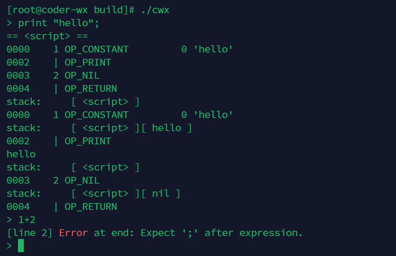

# Wx项目介绍🌈

> 使用C语言实现自己的编译器，如果觉得有帮助，请给我一个🌟，thank you！！！！！！！！

## 运行编译器

### Linux

> 在centos机器上测试没问题的，其他linux发行版机器应该也没问题，如果在别的机器上测试通过，可以提交pull
> request对这部分进行更改，欢迎 :tada:

1. 确保cmake安装完成，可以使用`cmake3 --version`
   查看版本，目前经过测试的版本是3.17往上。如未安装，可以访问[Cmake 下载地址](https://cmake.org/download/)
   使用源码安装。或者使用`yum install cmake3`进行安装（推荐）。

2. 切换到项目路径下，运行如下命令，编译项目
   
   ```bash
   mkdir build
   cd build
   cmake3 ../
   make
   ```
   
   > cmake还是cmake3可能取决于不同的操作系统

3. 执行编译器，编译器有两种模式

**交互模式**：运行`./cwx`,即可进行交互，编译器会一行一行解释命令。

**文件模式**:  可直接运行脚本文件，命令为`./cwx your_cwx_file`

> 最简单的hello word文件内容为: `print "Hello, world!";`

执行截图:  


### Windows

本项目在win下使用CLion进行开发，应该没有问题，未测试项目导入。

## 基本语法

### 注释

`//`用于注释

```java
// this is comment
```

每条语句以`;`结尾，和C和java的规则差不多。

### 动态变量

在Wx中变量不用像java和c这些语言一样，例如在c中需要`int a`来声明一个整型，Wx中的变量和Python的变量类似，直接赋值就行。

以下是Wx中支持的基本数据类型：

#### 布尔值

true和false，在逻辑运算的时候尤其有用

声明一个bool值: `var a = true;`

#### 数字

所有的数字，在底层都会被当成double来处理。

声明数字: `var a = 1;` 、 `var a = 1.13;`

#### 字符串

所有的字符串都必须使用两个`""`引起来

声明字符串: `var a = "hello";`

#### 空值

类似于java中的`NULL`，在Wx中空值使用`nil`来进行表示

### Expression

#### 数学

支持`+`、`-`、`*`、`/`等基本运算。这些基本都是二元运算符，但是注意`-`是特殊的，可以对一个数字取负数，例如如下代码。

`var a = 1; var b = -a;`

#### 比较运算符

```java
less < than;
lessThan <= orEqual;
greater > than;
greaterThan >= orEqual;
varA == varB;
varA != varB;
```

`==`成立的条件是，二者的数据类型相同，且其中的值相同，例如字符串"1.2"和数字1.2是不相等的，除去`==`的情况，剩余情况都是`!=`。

#### 逻辑运算

支持`!`进行取反操作:

```java
!true;  // false.
!false; // true.
```

同时支持`and`和`or`

```java
true and false; // false.
true and true;  // true.
false or false; // false.
true or false;  // true.
```

> 逻辑运算符支持"短路"操作，例如当and的时候，如果前面的逻辑表达式的值为false，则之后的表达式不会进行评估，同理当or的时候，第一个的表达式为true的时候第二个表达式不会进行评估。

#### 优先级调整

普通的逻辑表达式的优先级程度和正常的数学运算一样，可以通过`()`来完成对于优先级的调整，Wx会优先计算`()`中的内容。

###Statement

> expression和statement的不同在于，expression会产生返回值，主要是进行“计算”，而对于Statement可以理解为程序中的一句句代码，顺序执行。

一个简单的statement:`print "hello world";`

对于不同的作用域来说，使用`{}`来标定一个作用域，例如:

```java
var a = 0;
{
    print a; // 0
    var b = 1;
}
print b; // can't access to b
```

#### 变量声明

语法为:`var 变量名 = 变量初始值`，其中var为声明变量的关键字。

```java
var a = 1;
var b; // init val is nil
```

#### 逻辑控制

与常规的语法相同，支持`if else`、`for循环`、`while循环`

```java
if (condition) {
  print "yes";
} else {
  print "no";
}
```

多个`if/else`示例

```java
// this will print others
var a = 3;
if (a == 1){
    print "1";
} else if (a == 2){
    print "2";
} else {
    print "others";
}
```

`for循环`:

```java
var a = 1;
while (a < 10) {
  print a;
  a = a + 1;
}
```

等效的while循环:

```java
for (var a = 1; a < 10; a = a + 1) {
  print a;
}
```

> hint: 这里用到了等效二字，实际在解析的过程中，只实现了一种语法的解析，另一种是通过for和while循环的转换完成的。

### 函数

简单函数声明:

```java
fun printSum(a, b) {
  print a + b;
}


printSum(1,2); // 3
```

带返回值的函数声明:

```java
fun printSum(a, b) {
  return a + b;
}


print printSum(1,2); // 3
```

### 类

#### 类的定义

类的声明

```java
class Breakfast {
  cook() {
    print "Eggs a-fryin'!";
  }

  serve(who) {
    print "Enjoy your breakfast, " + who + ".";
  }
}
```

> 类中只有相应的函数，没有属性，属性需要再实例化之后给相应的实例化对象进行属性赋值。

类的初始化

```java
var breakfast = Breakfast();
print breakfast; // "Breakfast instance".
```

给类的属性赋值

```java
breakfast.meat = "sausage";
breakfast.bread = "sourdough";
```

在属性赋值之后，可以通过`this`关键字来访问相关的属性

```java
class Breakfast {
  serve(who) {
    print "Enjoy your"  + this.meat + " and " +
        this.bread + ", " + who + ".";
  }

}

var breakfast = Breakfast();
breakfast.meat = "sausage";
breakfast.bread = "sourdough";
breakfast.serve("Wx"); // Enjoy yoursausage and sourdough, Wx.
```

类的构造函数通过`Init`关键字来进行定义，并在初始化类的时候通过`()`中的参数进行传入。

```java
class Breakfast {
  init(meat, bread) {
    this.meat = meat;
    this.bread = bread;
  }

  // ...
}

var baconAndToast = Breakfast("bacon", "toast");
baconAndToast.serve("Wx");
// "Enjoy your bacon and toast, Wx."
```

#### 继承

在Wx中通过`<`来描述继承关系，例如`A < B`代表，A是B的一个子类。

```java
class Brunch < Breakfast {
  drink() {
    print "How about a Bloody Mary?";
  }
}
```

子类可以访问父类的方法

```java
var benedict = Brunch("ham", "English muffin");
benedict.serve("Noble Reader");
```

通过`super`关键字调用父类的方法

```java
class Breakfast {
    init(meat, bread) {
       this.meat = meat;
       this.bread = bread;
    }

    serve(who) {
    print "Enjoy your "  + this.meat + " and " +
        this.bread + ", " + who + ".";
    }

}

class Brunch < Breakfast {
    init(meat, bread, drink) {
        super.init(meat, bread);
        this.drink = drink;
    }

    drink() {
    print "How about a Bloody Mary?";
    }

    serve(who) {
        super.serve(who);
        print "this is Brunch call";
    }
}

var b = Brunch("egg","hhh","coco");
b.serve("Wx");
```

## 标准库

Wx中目前只支持两个内置函数，`print`，前面已经见识过了，就是将相应的内容输出到命令行中，第二个是`clock()`
，返回当前时间距离1970年1月1号0时0分0秒的**秒数**。

`print clock(); // 1.706271009748E9`

## 示例代码

### 用Wx求解斐波那契数列

```java
fun fib(i){
    if(i <= 1){
        return i;
    }
    return fib(i - 1) + fib(i - 2);
}

print fib(10); // 55
```

### 输出1-50的和

```java
var sum = 0;
for(var i = 1;i <= 100;i = i + 1) {
    sum = sum + i;
}
print sum; // 5050
```
